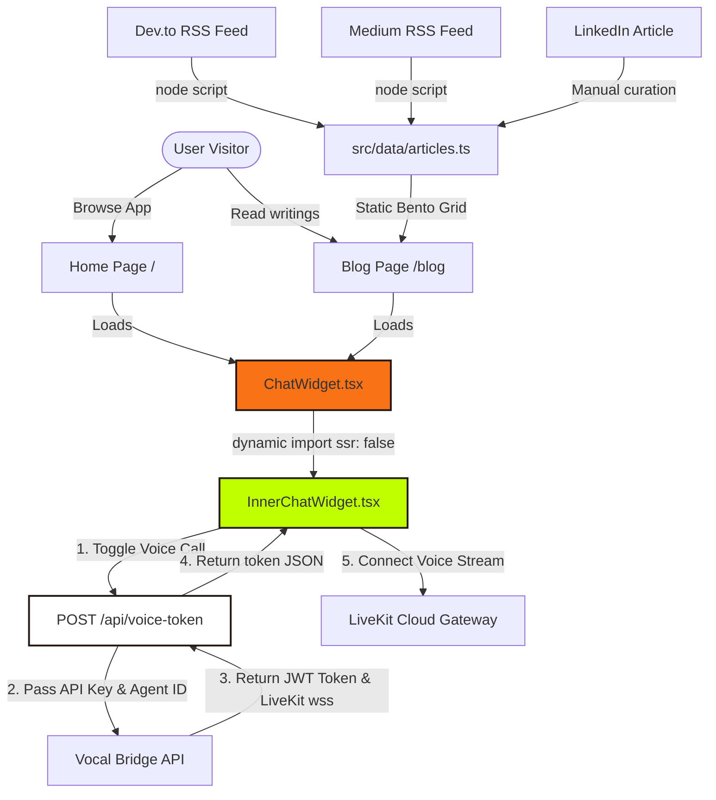
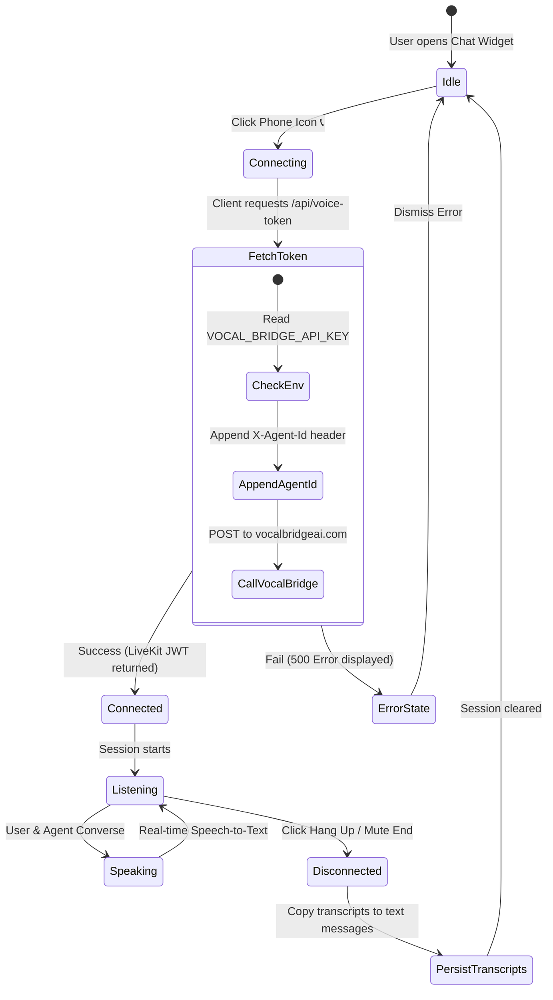

# Hargurjeet's AI Architect Portfolio & Voice Agent

A premium, interactive personal portfolio website showcasing professional experience as a Principal AI Architect, Bento Grid projects, an academic timeline, an RSS-powered article search feed, and an integrated real-time Voice AI chatbot.

The visual layout and interactive behaviors strictly replicate the **Refined Scientific Pop** design system (Neo-Brutalist styling, 0px border-radii, 2.5px heavy borders, and offset hard shadows).

---

## 🏗️ System Architecture & Routing Flow

The diagram below illustrates how client-side components, server routes, RSS feeds, and the Vocal Bridge voice orchestration API interact:



---

## 📞 Voice Call State Lifecycle

Below is the state transitions and transcript persistence lifecycle when a visitor initiates a voice call:



---

## 🚀 Core Features & Implementation Details

### 1. Dedicated Bento Blog Page (`/blog`)
*   **Dynamic Tag and Platform Filtering**: Filter articles by platform (Medium, Dev.to, LinkedIn) or tags (AI, LLM, Pydantic).
*   **Instant Search**: Full-text client-side search indexing matching titles, summaries, and tags.
*   **RSS Integration**: Populated via a Node utility script that parsed the author's live Medium and Dev.to feeds.

### 2. Vocal Bridge Voice AI Integration
*   **SSR Safe Import**: Next.js server pre-renders layouts. Since WebRTC (LiveKit) depends on browser APIs (`navigator`, `window`), we load `InnerChatWidget` dynamically with `{ ssr: false }` to prevent build crashes.
*   **Token API Proxy (`/api/voice-token`)**: 
    *   Exposes both `GET` and `POST` methods.
    *   Secures your `VOCAL_BRIDGE_API_KEY` on the server-side.
    *   Enforces `X-Agent-Id` headers so that account-scoped API keys route to the correct voice agent.
*   **Transcript Syncing**: Live voice transcripts are synchronized directly into the chat history state upon disconnection, ensuring that the conversational context is fully preserved.

---

## ⚙️ Configuration & Environment Variables

Create a `.env.local` file in your root directory with the following variables:

```env
FIREWORKS_API_KEY=your-fireworks-api-key
VOCAL_BRIDGE_API_KEY=vb_your-vocal-bridge-api-key
VOCAL_BRIDGE_AGENT_ID=your-voice-agent-uuid
```

> [!IMPORTANT]
> **Vercel Deployments Scope**: Ensure that `VOCAL_BRIDGE_API_KEY` and `VOCAL_BRIDGE_AGENT_ID` are configured in the **Production** environment scope in the Vercel Dashboard, then trigger a redeployment to make them active.

---

## 🛠️ Local Development

To run and test the project locally:

```bash
# 1. Clone & install dependencies
npm install

# 2. Run local Next.js server
npm run dev

# 3. Compile/Build check
npm run build
```
